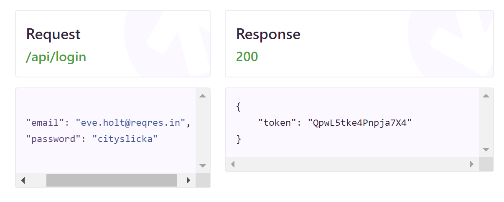

# Login using Context API

> The purpose of this project is not to be a huge application
>

## How to run the project?

- Download the ***zip*** or ***clone*** project
- Open the terminal and ***execute***: `cd login-context-api-main`
- Open the terminal again and ***execute***: `yarn`  to install the dependencies
- Then, run in terminal and ***execute*** again: `yarn dev`
- Open in the`Browser`: [http://localhost:3000](http://localhost:3000/)

> To login in application and check the Local Storage, you should use: [Reqres](https://reqres.in/)
>

- The [reqres](https://reqres.in/) is an open source application that make api methods, like posts or put.
- To login in app, use this login:

    

- Used stacks
    - React ⚛️
    - TypeScript ✏️
    - Vite App ⚡
    - styled-componentes 💅🏻
    - Framer Motion 🪄
    - Eslint **👁️**
    - Prettier 📝

- GitHub: [nikolaslopes](https://github.com/nikolaslopes) :octocat:
- LinkedIn: [nikolas-lopes](https://www.linkedin.com/in/nikolas-lopes-b06524209/)

Thanks for your support :shipit:

